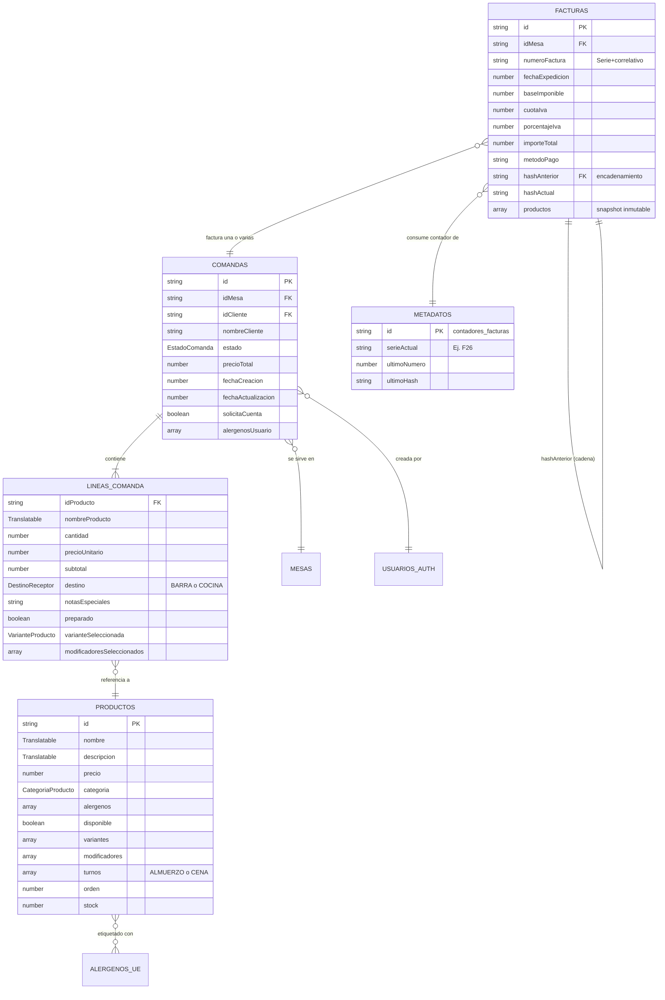
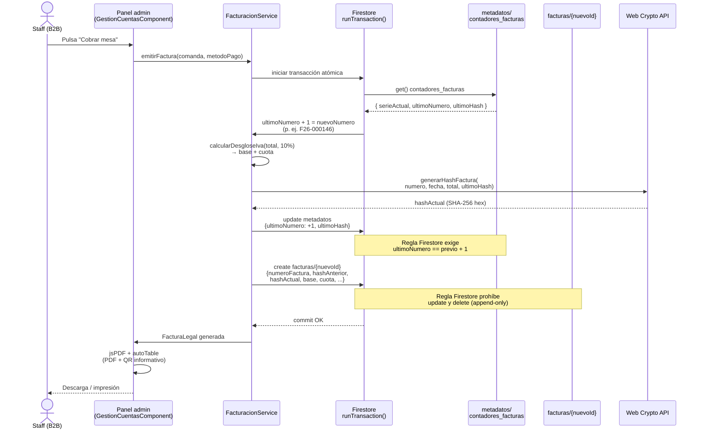
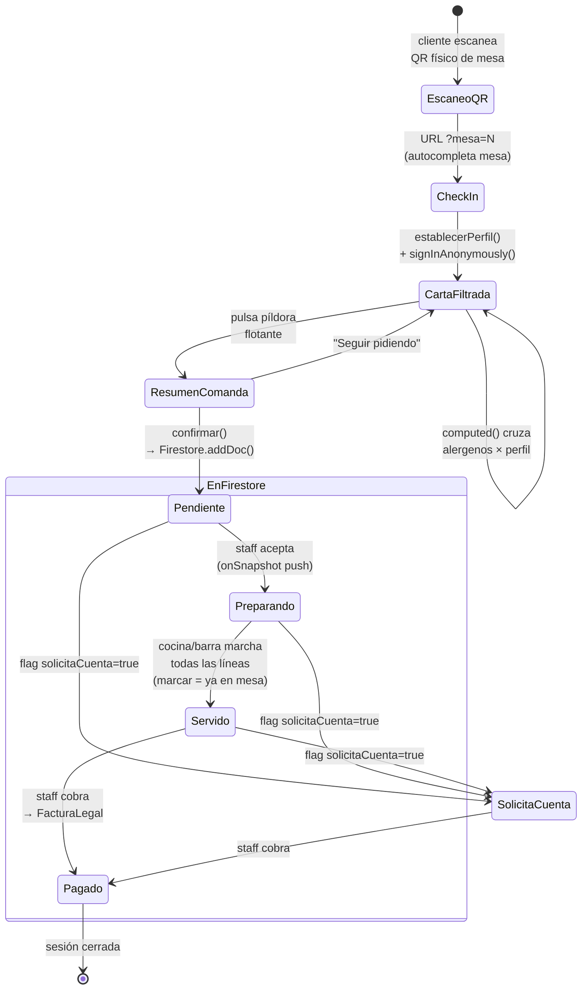
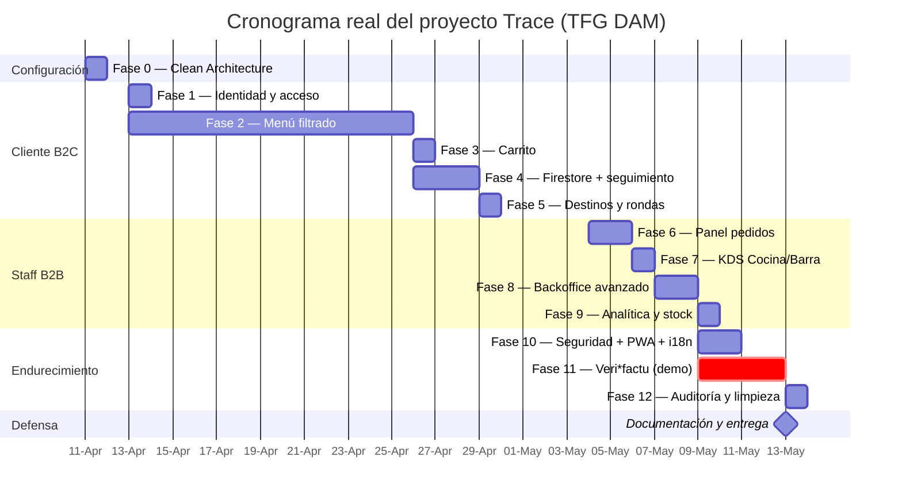

# Anexo: Diagramas técnicos del proyecto Trace

Este anexo concentra los diagramas que apoyan la lectura de la documentación
técnica del TFG. Todos están escritos en sintaxis Mermaid, lo que permite su
renderizado directo en GitHub, GitLab, MkDocs, VS Code y Obsidian sin
herramientas externas, y su exportación a SVG/PNG mediante CLI (`mmdc`).

Los diagramas reflejan el estado real del repositorio a fecha **2026-05-13**, y
están vinculados al código mediante referencias a los modelos
[`app-comandas/src/app/core/models/`](../app-comandas/src/app/core/models/) y a
las reglas [`firestore.rules`](../app-comandas/firestore.rules).

---

## 1. Arquitectura por capas (Clean Architecture)

Vista lógica de la organización del *frontend* Angular 20 (Standalone) y su
relación con el *backend* Firebase BaaS. La separación `core` / `shared` /
`features` impone que solo `features` dependa de `core`, nunca al revés.

```mermaid
flowchart TB
    subgraph Cliente["Cliente — Angular 20 + Ionic 8 (Standalone)"]
        direction TB
        subgraph Features["features/ (vistas de dominio)"]
            FA["autenticacion<br/>(check-in B2C, login B2B)"]
            FC["carta<br/>(menú filtrado por alérgenos)"]
            FCM["comandas<br/>(resumen, seguimiento)"]
            FAD["admin<br/>(panel-pedidos, KDS, facturas)"]
        end
        subgraph Shared["shared/ (UI reutilizable)"]
            SC["componentes<br/>(admin-config-bar, resumen-flotante)"]
            SP["pipes & directivas"]
        end
        subgraph Core["core/ (servicios singleton)"]
            CS["services<br/>(UsuarioService, ComandaService,<br/>ComandaFirestoreService, AdminAuthService,<br/>FacturacionService, MetricasService,<br/>HorarioRestauranteService, AudioService,<br/>UserSettingsService)"]
            CM["models<br/>(Producto, Comanda, FacturaLegal,<br/>PerfilUsuario, HorarioRestaurante)"]
            CG["guards & providers<br/>(adminGuard, ioniconsProvider)"]
        end
        Features --> Shared
        Features --> Core
        Shared --> Core
    end

    subgraph Firebase["Firebase BaaS (europe-west1)"]
        FAuth["Auth<br/>(anónima B2C + email/password B2B)"]
        FFS["Cloud Firestore<br/>(comandas, productos,<br/>facturas, metadatos,<br/>configuracion)"]
        FRules["Security Rules<br/>(append-only facturas,<br/>contador +1 forzado,<br/>default-deny)"]
        FHost["Hosting + PWA"]
    end

    Core <-->|onSnapshot / setDoc /<br/>runTransaction| FFS
    Core <-->|signInAnonymously /<br/>signInWithEmailAndPassword| FAuth
    FRules -.->|aplica sobre| FFS
    Cliente -.->|servido desde| FHost
```



> **Lectura.** Los servicios de `core/` son el único punto que conoce el SDK de
> Firebase. Las vistas de `features/` consumen exclusivamente *signals*
> expuestos por dichos servicios, lo que permite reemplazar el *backend* sin
> tocar las plantillas.

---

## 2. Modelo Entidad-Relación de Firestore

Modelado lógico de las cinco colecciones del proyecto. Firestore es NoSQL
documental, por lo que las relaciones se expresan mediante claves foráneas no
forzadas a nivel de motor; la integridad referencial se garantiza por
convención del cliente y por las reglas de seguridad.



> **Nota fiscal.** La autorrelación `FACTURAS → FACTURAS (hashAnterior)`
> implementa la cadena de integridad SHA-256 exigida por el RD 1007/2023. Las
> reglas de Firestore impiden cualquier `update` o `delete` sobre esta
> colección.

---

## 3. Secuencia de emisión de factura Veri\*factu (modo demostración)

Diagrama de secuencia que ilustra la interacción entre el cliente staff, el
servicio de facturación y Firestore al cobrar una cuenta. La transacción
`runTransaction` garantiza atomicidad entre el incremento del contador y la
escritura de la nueva factura.



---

## 4. Flujo de datos B2C en tiempo real

Diagrama de estados de la sesión del comensal, desde el escaneo del QR hasta
la finalización del servicio. Las transiciones marcadas con `onSnapshot`
representan empujes (`push`) en tiempo real desde Firestore.



> **Resiliencia.** Cualquier transición `→ EnFirestore` se persiste en
> `localStorage` (`UsuarioService`, `ComandaService`), de modo que un F5 o un
> corte de red recupera la sesión completa sin pérdida de carrito.

---

## 5. Diagrama Gantt de fases reales

Cronograma reconstruido a partir del historial `git log --reverse` del
repositorio. Refleja la ejecución real del proyecto entre el 11 de abril y el
12 de mayo de 2026.



---

## Cómo regenerar los diagramas

Para exportar todos los diagramas a SVG/PNG fuera del navegador:

```bash
npm install -g @mermaid-js/mermaid-cli
mmdc -i docs/diagramas.md -o docs/_render/diagramas.pdf -t neutral
```

Los IDE modernos (VS Code con la extensión *Mermaid Preview*, JetBrains,
Obsidian) renderizan los bloques ```` ```mermaid ```` de forma nativa sin
configuración adicional.
